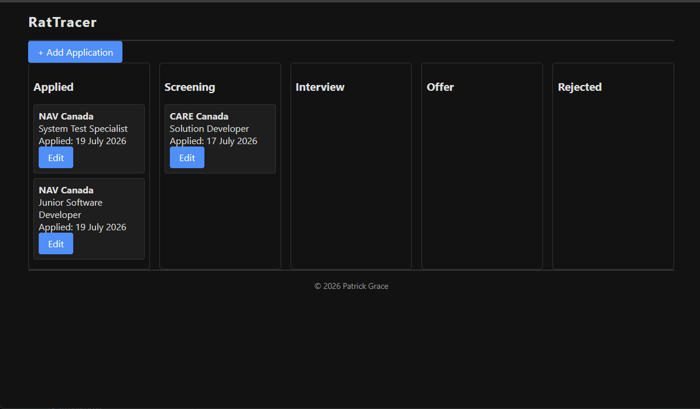

# RatTracer

*Tracing your place in the rat race.*

RatTracer is a personal tool for keeping track of job applications — where you applied, what stage each one is at, and quick links to the resume, cover letter, or job posting for each one.

Instead of a spreadsheet or a pile of sticky notes, applications live on a visual board with a column for each stage of the hiring process (Applied, Screening, Interview, Offer, Rejected). Moving an application forward is as simple as dragging its card to the next column, and every move is automatically logged with a date — so there's always a clear record of how each application actually progressed.



## What It Does

- Add a new application with the company, role, source, and any notes
- See every application at a glance, grouped by stage
- Move an application to a new stage with a drag and drop
- Keep a running history of every stage change, with dates
- Link directly to the related documents (resume, cover letter, job posting) stored in Google Drive
- Fix mistakes — dates and history entries can be corrected right in the app if something gets logged wrong (an accidental drag, a backdated application, etc.)

## Why It's Useful

Job searching means juggling a lot of applications at once, each moving at its own pace. RatTracer keeps all of that in one place instead of scattered across emails, spreadsheets, and memory, making it easy to see the whole picture at a glance and know exactly where things stand.

It runs privately on a home server — it isn't a public website, and there's no login system, since only one person (its creator) ever uses it.

## Running It Yourself

Quick version, two terminals from the project root:

```bash
# Terminal 1 — API
cd job-tracker-api
npm install
npm run dev
```

```bash
# Terminal 2 — Angular app
cd job-tracker
npm install
ng serve
```

Then open `http://localhost:4200`. You'll need your own MongoDB connection string in a `.env` file inside `job-tracker-api/` — see the [technical design doc](docs/TECHNICAL_DESIGN.md#getting-started) for full setup details.

## Learn More

For the tech stack, architecture, API details, and the reasoning behind decisions made along the way, see [`docs/TECHNICAL_DESIGN.md`](docs/TECHNICAL_DESIGN.md).
