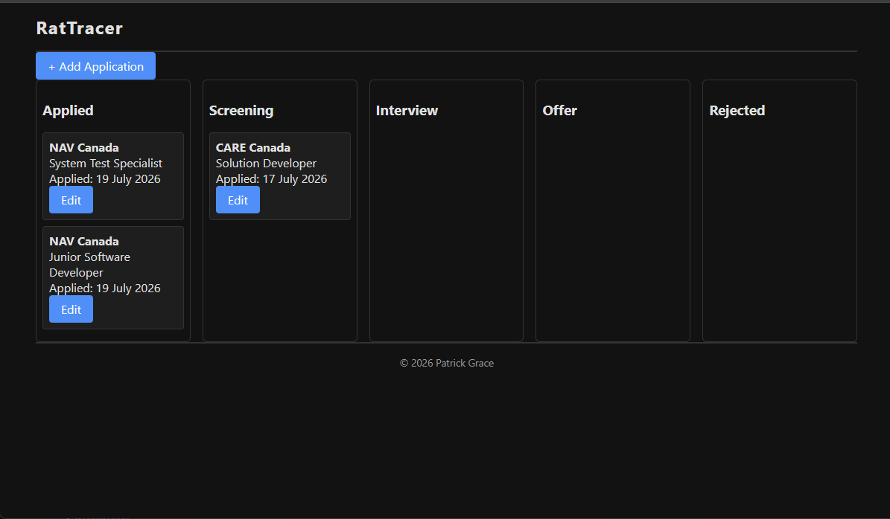

## Project Name
RatTracer

*Tracing your place in the rat race.*

## Project Description
RatTracer is a personal tool for keeping track of job applications — where you applied, what stage each one is at, and quick links to the resume, cover letter, or job posting for each one.

Instead of a spreadsheet or a pile of sticky notes, applications live on a visual board with a column for each stage of the hiring process (Applied, Screening, Interview, Offer, Rejected). Moving an application forward is as simple as dragging its card to the next column, and every move is automatically logged with a date — so there's always a clear record of how each application actually progressed.

It's built on the MEAN stack as two independent applications: an Angular front end and an Express REST API that stores applications in MongoDB Atlas through Mongoose. For the tech stack, architecture, API details, and the reasoning behind decisions made along the way, see [`docs/TECHNICAL_DESIGN.md`](docs/TECHNICAL_DESIGN.md).



## Technologies
- Angular 21
- Angular CDK (drag-and-drop, dialogs)
- TypeScript
- HTML
- SCSS
- Node.js
- Express 5
- MongoDB Atlas
- Mongoose
- dotenv
- cors
- nodemon
- Docker / Docker Compose
- nginx

## How to Run
**Requirements:** [Node.js](https://nodejs.org) and your own MongoDB connection string (for example, from a free MongoDB Atlas cluster).

1. Clone or download this repository.
2. Create a `.env` file inside `job-tracker-api/` with:
   ```
   MONGO_URI=your-mongodb-connection-string
   PORT=3000
   ```

Quick version, two terminals from the project root:

```bash
# Terminal 1 — API
cd job-tracker-api
npm install
npm run dev
```

```bash
# Terminal 2 — Angular app
cd job-tracker
npm install
ng serve
```

Then open `http://localhost:4200`. If you don't have the Angular CLI installed globally, use `npm start` instead of `ng serve`. See the [technical design doc](docs/TECHNICAL_DESIGN.md#getting-started) for full setup details.

**Running with Docker:** with the `.env` file in place, run `docker compose up -d --build` from the project root, then open `http://localhost:3050`. The Angular app is built and served by nginx, which forwards `/api` requests to the API container.

## Features
- Add a new application with the company, role, source, and any notes
- See every application at a glance, grouped by stage
- Move an application to a new stage with a drag and drop
- Keep a running history of every stage change, with dates
- Link directly to the related documents (resume, cover letter, job posting) stored in Google Drive
- Fix mistakes — dates and history entries can be corrected right in the app if something gets logged wrong (an accidental drag, a backdated application, etc.)

Also included:

- Detail view for each application, opened by clicking its card, showing the status history timeline and a button to open its Google Drive folder
- Create and edit forms in pop-up dialogs, built with Angular reactive forms
- Error handling for unreliable connections: a Retry button if the board fails to load, forms that stay open with your input intact if saving fails, and cards that automatically move back to their original column if a drag-and-drop update fails
- Dates displayed in UTC, avoiding the common bug where dates show up one day early
- Dark theme built on CSS custom properties
- Express REST API with endpoints to list, create, read, update, and delete applications
- Docker deployment with a multi-stage build, nginx reverse proxy, and containers that restart automatically, running on a home server

## Author
Patrick Grace — [patrickmgrace.com](https://www.patrickmgrace.com/) — GitHub: [StandardGrace](https://github.com/StandardGrace)

## Why It's Useful

Job searching means juggling a lot of applications at once, each moving at its own pace. RatTracer keeps all of that in one place instead of scattered across emails, spreadsheets, and memory, making it easy to see the whole picture at a glance and know exactly where things stand.

It runs privately on a home server — it isn't a public website, and there's no login system, since only one person (its creator) ever uses it.
